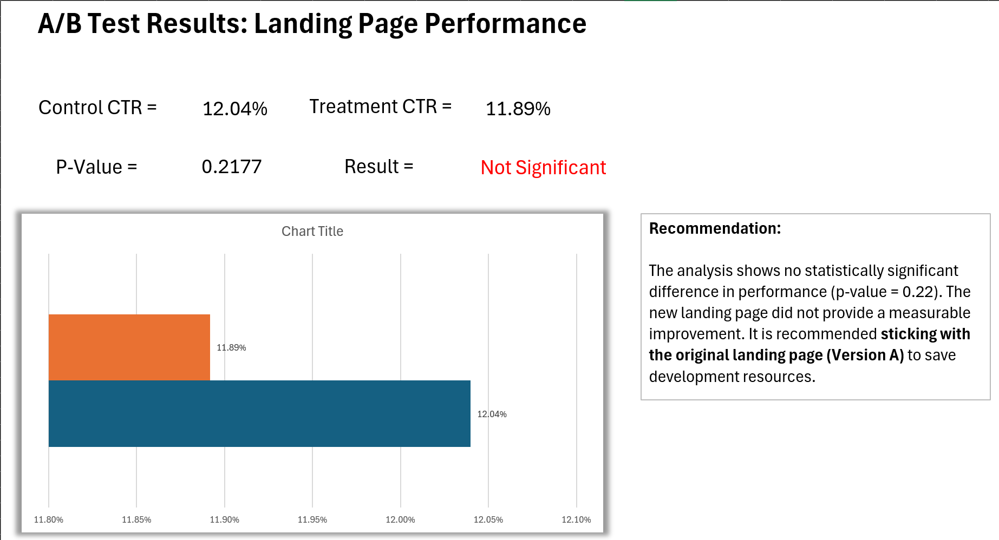

# A/B Test Analysis for Marketing Campaign

[](https://python.org)
[](https://jupyter.org)
[](LICENSE)
[]()

A comprehensive statistical analysis of A/B testing data to determine the effectiveness of different landing page designs on user conversion rates. This project demonstrates professional data analysis workflows, statistical testing methodologies, and data visualization best practices.

## 📋 Project Overview

### Business Context
> **Note**: The business problem and context are hypothetical, created specifically to practice professional data analysis workflows and A/B testing methodologies.

This analysis evaluates whether a new landing page design (Treatment) performs better than the current design (Control) in terms of user conversion rates. Using rigorous statistical methods, we provide data-driven recommendations for marketing strategy decisions.

### Key Findings
- **Control Group Conversion Rate**: 12.04% (n=147,202)
- **Treatment Group Conversion Rate**: 11.89% (n=147,278)
- **Statistical Significance**: No significant difference found (p=0.2177 > α=0.05)
- **Business Recommendation**: Maintain current landing page design

## 🗂️ Project Structure

```
AB Test Analysis for Marketing Campaign/
│
├── data/
│   ├── 00_raw/                              # Raw, unprocessed data
│   │   └── raw_ab_data.csv                 # Original dataset (294,482 records)
│   └── 01_cleaned/                         # Processed, analysis-ready data
│       └── cleaned_ab_data.csv             # Cleaned dataset with proper timestamps
│
├── notebooks/                              # Jupyter notebooks for analysis
│   ├── 01_initial_inspection_and_data_cleaning.ipynb  # Data quality assessment & cleaning
│   └── 02_analysis_and_visualization.ipynb            # Statistical analysis & visualizations
│
├── outputs/                                # Generated reports and visualizations
│   ├── visualizations/                     # High-quality charts (300 DPI PNG)
│   │   ├── 01_conversion_rate_comparison.png
│   │   ├── 03_conversion_funnel.png
│   │   ├── 04_statistical_test_results.png
│   │   └── 07_complete_dashboard.png
│   ├── AB_Test_Analysis.xlsx              # Excel file with data, analysis & dashboard
│   └── REPORT.md                          # Comprehensive analysis report
│
├── WORKFLOW.md                            # Detailed project methodology
├── README.md                              # Project documentation (this file)
└─── .gitignore                            # Git ignore file
```

## 🔬 Methodology

### Statistical Approach
- **Test Type**: Chi-Squared Test for Independence
- **Significance Level**: α = 0.05
- **Sample Size**: 294,480 total users (balanced allocation)
- **Primary Metric**: Conversion Rate (CTR)

### Hypotheses
- **H₀**: No difference in conversion rates between Control and Treatment groups
- **H₁**: Significant difference exists between the two groups

### Data Quality Assurance
- ✅ No missing values
- ✅ No duplicate records
- ✅ Balanced group allocation (50/50 split)
- ✅ Consistent categorical data entries

## 📊 Key Visualizations

1. **Conversion Rate Comparison**: Bar chart with 95% confidence intervals
2. **Conversion Funnel**: Visual comparison of total users vs conversions
3. **Statistical Test Results**: Chi-squared test interpretation
4. **Executive Dashboard**: Comprehensive summary of all metrics
5. **Excel Dashboard**: Interactive spreadsheet with cleaned data and summary analytics

## 🗂️ Key Deliverables

### **Excel Analysis File (`AB_Test_Analysis.xlsx`)**
A comprehensive Excel workbook containing:
- **Cleaned Data Sheet**: Processed dataset ready for analysis
- **Analysis Summary**: Key conversion metrics and statistical test results
- **Dashboard**: Executive summary showing:
  - Conversion rate summary table
  - Statistical significance (p-value = 0.2177)
  - Business recommendation
  - Key performance indicators


*Excel Dashboard showing key A/B test results and business recommendations*

### **Python Analysis**
- Jupyter notebooks with complete statistical analysis
- High-resolution visualizations for presentations
- Detailed methodology and code documentation

## 🛠️ Technologies Used

- **Python 3.8+**: Core analysis language
- **Pandas**: Data manipulation and analysis
- **Matplotlib**: Data visualization and plotting
- **Seaborn**: Statistical data visualization
- **SciPy**: Statistical testing (chi2_contingency)
- **Statsmodels**: Confidence interval calculations
- **NumPy**: Numerical computations
- **Jupyter Notebook**: Interactive development environment

## 🚀 Getting Started

### Prerequisites
```bash
Python 3.8 or higher
Jupyter Notebook or JupyterLab
Required Python packages (see Installation)
```

### Installation
1. **Clone the repository**
   ```bash
   git clone https://github.com/yourusername/ab-test-analysis-marketing.git
   cd ab-test-analysis-marketing
   ```

2. **Install required packages**
   ```bash
   pip install pandas matplotlib seaborn scipy statsmodels numpy jupyter
   ```

3. **Launch Jupyter Notebook**
   ```bash
   jupyter notebook
   ```

4. **Run the analysis**
   - Start with `01_initial_inspection_and_data_cleaning.ipynb`
   - Proceed to `02_analysis_and_visualization.ipynb`

### Quick Start
If you want to jump straight to the results:
- **Excel Dashboard**: Open `outputs/AB_Test_Analysis.xlsx` for executive summary and interactive analysis
- View the comprehensive analysis in `outputs/REPORT.md`
- Check visualizations in `outputs/visualizations/`
- Review methodology in `WORKFLOW.md`

## 📈 Analysis Workflow

1. **Data Retrieval**: Load raw A/B testing data from Kaggle dataset
2. **Data Cleaning**: Handle timestamp formatting and validate data quality
3. **Exploratory Analysis**: Calculate conversion rates and sample distributions
4. **Statistical Testing**: Perform Chi-squared test for independence
5. **Visualization**: Create professional charts for stakeholder communication
6. **Reporting**: Generate comprehensive report with business recommendations

## 📋 Results Summary

| Metric | Control Group | Treatment Group | Difference |
|--------|---------------|-----------------|------------|
| **Users** | 147,202 | 147,278 | +76 |
| **Conversions** | 17,723 | 17,514 | -209 |
| **Conversion Rate** | 12.04% | 11.89% | -0.15% |
| **95% CI** | [11.87%, 12.21%] | [11.72%, 12.06%] | - |

**Statistical Test Results:**
- Chi-squared statistic: 1.5193
- P-value: 0.2177
- Result: No significant difference (p > 0.05)

## 🎯 Business Recommendations

1. **Maintain Current Design**: No evidence that the new landing page performs better
2. **Cost Efficiency**: Avoid implementation costs and potential risks
3. **Future Testing**: Consider more substantial design changes for future A/B tests
4. **Continuous Monitoring**: Track performance metrics for ongoing optimization

## 📁 File Descriptions

- **`WORKFLOW.md`**: Detailed project methodology and stage-by-stage breakdown
- **`REPORT.md`**: Executive summary with statistical results and business implications
- **`AB_Test_Analysis.xlsx`**: Excel workbook with cleaned data, analysis summary, and executive dashboard
- **Notebook 01**: Data quality assessment, cleaning, and preparation
- **Notebook 02**: Statistical analysis, hypothesis testing, and visualization
- **Visualizations**: Publication-ready charts saved in high resolution


*This project demonstrates proficiency in statistical analysis, A/B testing methodologies, data visualization, and business communication for data-driven decision making.*